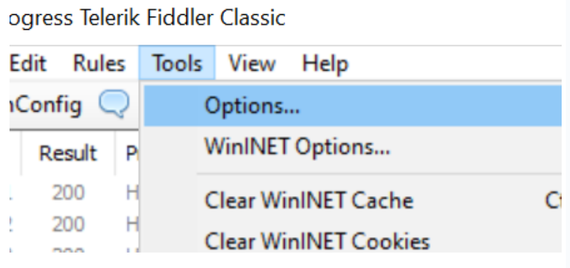
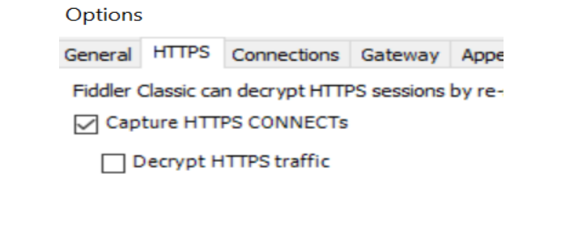
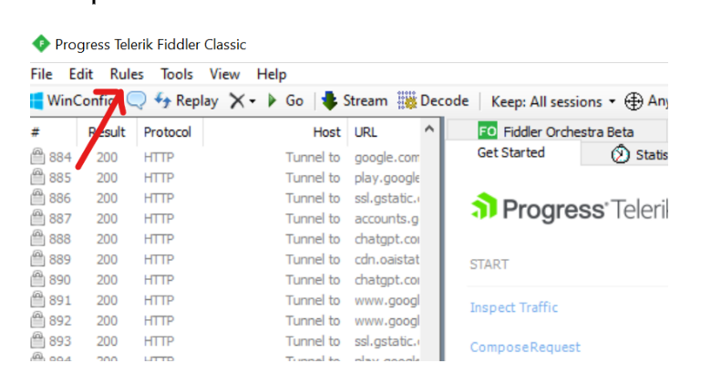
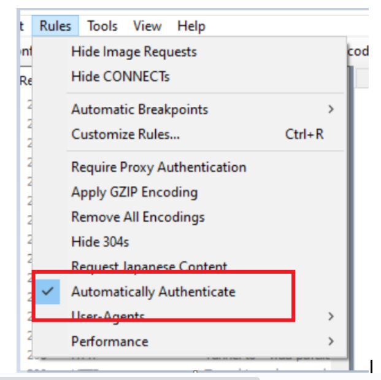
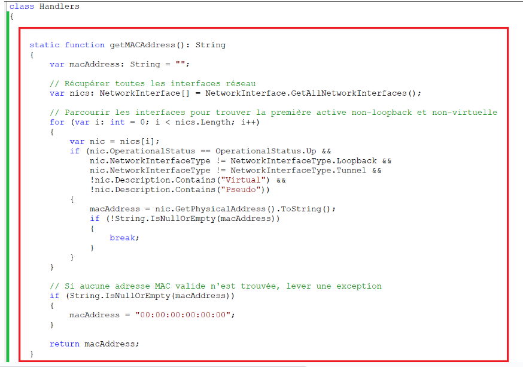
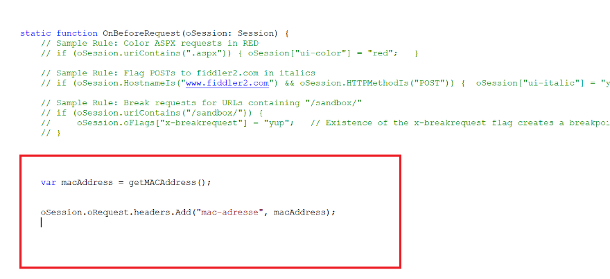

# Guide d'Installation de Fiddler

Ce guide vous montre comment télécharger, installer et configurer Fiddler pour intercepter le trafic HTTP et HTTPS.

## Télécharger Fiddler

1. Allez sur le site officiel de Fiddler: [https://www.telerik.com/download/fiddler](https://www.telerik.com/download/fiddler).
2. Téléchargez la version de Fiddler pour votre système d'exploitation (Windows).

## Installer Fiddler

1. Exécutez le fichier d'installation téléchargé.
2. Suivez les instructions à l'écran pour compléter l'installation.

## Configuration de Fiddler pour Intercepter le Trafic HTTP et HTTPS

### Lancer Fiddler

1. Ouvrez Fiddler après l'installation.

### Configurer la capture HTTPS

1. Allez dans `Tools` > `Options`.

   
   
2. Sous l'onglet `HTTPS`, assurez-vous que l'option `Capture HTTPS CONNECTs` est activée.

   

### Modification des Requêtes HTTP et HTTPS

1. Allez dans `Rules` > `Automatically Authenticate`.

   

2. Allez dans `Rules` > `Customize Rules`.

   

   Cela ouvrira un éditeur de texte où vous pourrez écrire des scripts en utilisant JScript.NET pour modifier les requêtes et réponses.

## scripts


## ajouter func  getMACAdress() et leur contenu  à l'intérieur de  class Handlers:





## Chercher sur la function OnBeforeRequest et ajouter ce script:




---


# Copiez ce script et collez-le dans Customize Rules .


```javascript

import System;
import System.Windows.Forms;
import Fiddler;
import System.Net.NetworkInformation;


// INTRODUCTION
//
// Well, hello there!
//
// Don't be scared! :-)
//
// This is the FiddlerScript Rules file, which creates some of the menu commands and
// other features of Progress Telerik Fiddler Classic. You can edit this file to modify or add new commands.
//
// The original version of this file is named SampleRules.js and it is in the
// \Program Files\Fiddler\ folder. When Fiddler Classic first runs, it creates a copy named
// CustomRules.js inside your \Documents\Fiddler2\Scripts folder. If you make a 
// mistake in editing this file, simply delete the CustomRules.js file and restart
// Fiddler Classic. A fresh copy of the default rules will be created from the original
// sample rules file.

// The best way to edit this file is to install the FiddlerScript Editor, part of
// the free SyntaxEditing addons. Get it here: http://fiddler2.com/r/?SYNTAXVIEWINSTALL

// GLOBALIZATION NOTE: Save this file using UTF-8 Encoding.

// JScript.NET Reference
// http://fiddler2.com/r/?msdnjsnet
//
// FiddlerScript Reference
// http://fiddler2.com/r/?fiddlerscriptcookbook

class Handlers
{
		
			
	static function getMACAddress(): String
	{
		var macAddress: String = "";
        
		// Récupérer toutes les interfaces réseau
		var nics: NetworkInterface[] = NetworkInterface.GetAllNetworkInterfaces();
        
		// Parcourir les interfaces pour trouver la première active non-loopback et non-virtuelle
		for (var i: int = 0; i < nics.Length; i++)
		{
			var nic = nics[i];
			if (nic.OperationalStatus == OperationalStatus.Up &&
				nic.NetworkInterfaceType != NetworkInterfaceType.Loopback &&
				nic.NetworkInterfaceType != NetworkInterfaceType.Tunnel &&
				!nic.Description.Contains("Virtual") &&
				!nic.Description.Contains("Pseudo"))
			{
				macAddress = nic.GetPhysicalAddress().ToString();
				if (!String.IsNullOrEmpty(macAddress))
				{
					break;
				}
			}
		}

		// Si aucune adresse MAC valide n'est trouvée, lever une exception
		if (String.IsNullOrEmpty(macAddress))
		{
			macAddress = "00:00:00:00:00:00";
 		}
        
		return macAddress;
	}
		
			
				
	
    // *****************
    //
    // This is the Handlers class. Pretty much everything you ever add to FiddlerScript
    // belongs right inside here, or inside one of the already-existing functions below.
    //
    // *****************

    // The following snippet demonstrates a custom-bound column for the Web Sessions list.
    // See http://fiddler2.com/r/?fiddlercolumns for more info
    /*
      public static BindUIColumn("Method", 60)
      function FillMethodColumn(oS: Session): String {
         return oS.RequestMethod;
      }
    */

    // The following snippet demonstrates how to create a custom tab that shows simple text
    /*
       public BindUITab("Flags")
       static function FlagsReport(arrSess: Session[]):String {
        var oSB: System.Text.StringBuilder = new System.Text.StringBuilder();
        for (var i:int = 0; i<arrSess.Length; i++)
        {
            oSB.AppendLine("SESSION FLAGS");
            oSB.AppendFormat("{0}: {1}\n", arrSess[i].id, arrSess[i].fullUrl);
            for(var sFlag in arrSess[i].oFlags)
            {
                oSB.AppendFormat("\t{0}:\t\t{1}\n", sFlag.Key, sFlag.Value);
            }
        }
        return oSB.ToString();
    }
    */

    // You can create a custom menu like so:
    /*
    QuickLinkMenu("&Links") 
    QuickLinkItem("IE GeoLoc TestDrive", "http://ie.microsoft.com/testdrive/HTML5/Geolocation/Default.html")
    QuickLinkItem("FiddlerCore", "http://fiddler2.com/fiddlercore")
    public static function DoLinksMenu(sText: String, sAction: String)
    {
        Utilities.LaunchHyperlink(sAction);
    }
    */

    public static RulesOption("Hide 304s")
    BindPref("fiddlerscript.rules.Hide304s")
    var m_Hide304s: boolean = false;

    // Cause Fiddler Classic to override the Accept-Language header with one of the defined values
    public static RulesOption("Request &Japanese Content")
    var m_Japanese: boolean = false;

    // Automatic Authentication
    public static RulesOption("&Automatically Authenticate")
    BindPref("fiddlerscript.rules.AutoAuth")
    var m_AutoAuth: boolean = false;

    // Cause Fiddler Classic to override the User-Agent header with one of the defined values
    // The page http://browserscope2.org/browse?category=selectors&ua=Mobile%20Safari is a good place to find updated versions of these
    RulesString("&User-Agents", true) 
    BindPref("fiddlerscript.ephemeral.UserAgentString")
    RulesStringValue(0,"Netscape &3", "Mozilla/3.0 (Win95; I)")
    RulesStringValue(1,"WinPhone8.1", "Mozilla/5.0 (Mobile; Windows Phone 8.1; Android 4.0; ARM; Trident/7.0; Touch; rv:11.0; IEMobile/11.0; NOKIA; Lumia 520) like iPhone OS 7_0_3 Mac OS X AppleWebKit/537 (KHTML, like Gecko) Mobile Safari/537")
    RulesStringValue(2,"&Safari5 (Win7)", "Mozilla/5.0 (Windows; U; Windows NT 6.1; en-US) AppleWebKit/533.21.1 (KHTML, like Gecko) Version/5.0.5 Safari/533.21.1")
    RulesStringValue(3,"Safari9 (Mac)", "Mozilla/5.0 (Macintosh; Intel Mac OS X 10_11) AppleWebKit/601.1.56 (KHTML, like Gecko) Version/9.0 Safari/601.1.56")
    RulesStringValue(4,"iPad", "Mozilla/5.0 (iPad; CPU OS 8_3 like Mac OS X) AppleWebKit/600.1.4 (KHTML, like Gecko) Version/8.0 Mobile/12F5027d Safari/600.1.4")
    RulesStringValue(5,"iPhone6", "Mozilla/5.0 (iPhone; CPU iPhone OS 8_3 like Mac OS X) AppleWebKit/600.1.4 (KHTML, like Gecko) Version/8.0 Mobile/12F70 Safari/600.1.4")
    RulesStringValue(6,"IE &6 (XPSP2)", "Mozilla/4.0 (compatible; MSIE 6.0; Windows NT 5.1; SV1)")
    RulesStringValue(7,"IE &7 (Vista)", "Mozilla/4.0 (compatible; MSIE 7.0; Windows NT 6.0; SLCC1)")
    RulesStringValue(8,"IE 8 (Win2k3 x64)", "Mozilla/4.0 (compatible; MSIE 8.0; Windows NT 5.2; WOW64; Trident/4.0)")
    RulesStringValue(9,"IE &8 (Win7)", "Mozilla/4.0 (compatible; MSIE 8.0; Windows NT 6.1; Trident/4.0)")
    RulesStringValue(10,"IE 9 (Win7)", "Mozilla/5.0 (compatible; MSIE 9.0; Windows NT 6.1; Trident/5.0)")
    RulesStringValue(11,"IE 10 (Win8)", "Mozilla/5.0 (compatible; MSIE 10.0; Windows NT 6.2; WOW64; Trident/6.0)")
    RulesStringValue(12,"IE 11 (Surface2)", "Mozilla/5.0 (Windows NT 6.3; ARM; Trident/7.0; Touch; rv:11.0) like Gecko")
    RulesStringValue(13,"IE 11 (Win8.1)", "Mozilla/5.0 (Windows NT 6.3; WOW64; Trident/7.0; rv:11.0) like Gecko")
    RulesStringValue(14,"Edge (Win10)", "Mozilla/5.0 (Windows NT 10.0) AppleWebKit/537.36 (KHTML, like Gecko) Chrome/46.0.2486.0 Safari/537.36 Edge/13.11082")
    RulesStringValue(15,"&Opera", "Opera/9.80 (Windows NT 6.2; WOW64) Presto/2.12.388 Version/12.17")
    RulesStringValue(16,"&Firefox 3.6", "Mozilla/5.0 (Windows; U; Windows NT 6.1; en-US; rv:1.9.2.7) Gecko/20100625 Firefox/3.6.7")
    RulesStringValue(17,"&Firefox 43", "Mozilla/5.0 (Windows NT 6.3; WOW64; rv:43.0) Gecko/20100101 Firefox/43.0")
    RulesStringValue(18,"&Firefox Phone", "Mozilla/5.0 (Mobile; rv:18.0) Gecko/18.0 Firefox/18.0")
    RulesStringValue(19,"&Firefox (Mac)", "Mozilla/5.0 (Macintosh; Intel Mac OS X 10.8; rv:24.0) Gecko/20100101 Firefox/24.0")
    RulesStringValue(20,"Chrome (Win)", "Mozilla/5.0 (Windows NT 6.3; Win64; x64) AppleWebKit/537.36 (KHTML, like Gecko) Chrome/48.0.2564.48 Safari/537.36")
    RulesStringValue(21,"Chrome (Android)", "Mozilla/5.0 (Linux; Android 5.1.1; Nexus 5 Build/LMY48B) AppleWebKit/537.36 (KHTML, like Gecko) Chrome/43.0.2357.78 Mobile Safari/537.36")
    RulesStringValue(22,"ChromeBook", "Mozilla/5.0 (X11; CrOS x86_64 6680.52.0) AppleWebKit/537.36 (KHTML, like Gecko) Chrome/41.0.2272.74 Safari/537.36")
    RulesStringValue(23,"GoogleBot Crawler", "Mozilla/5.0 (compatible; Googlebot/2.1; +http://www.google.com/bot.html)")
    RulesStringValue(24,"Kindle Fire (Silk)", "Mozilla/5.0 (Macintosh; U; Intel Mac OS X 10_6_3; en-us; Silk/1.0.22.79_10013310) AppleWebKit/533.16 (KHTML, like Gecko) Version/5.0 Safari/533.16 Silk-Accelerated=true")
    RulesStringValue(25,"&Custom...", "%CUSTOM%")
    public static var sUA: String = null;

    // Cause Fiddler Classic to delay HTTP traffic to simulate typical 56k modem conditions
    public static RulesOption("Simulate &Modem Speeds", "Per&formance")
    var m_SimulateModem: boolean = false;

    // Removes HTTP-caching related headers and specifies "no-cache" on requests and responses
    public static RulesOption("&Disable Caching", "Per&formance")
    var m_DisableCaching: boolean = false;

    public static RulesOption("Cache Always &Fresh", "Per&formance")
    var m_AlwaysFresh: boolean = false;
        
    // Force a manual reload of the script file.  Resets all
    // RulesOption variables to their defaults.
    public static ToolsAction("Reset Script")
    function DoManualReload() { 
        FiddlerObject.ReloadScript();
    }

    public static ContextAction("Decode Selected Sessions")
    function DoRemoveEncoding(oSessions: Session[]) {
        for (var x:int = 0; x < oSessions.Length; x++){
            oSessions[x].utilDecodeRequest();
            oSessions[x].utilDecodeResponse();
        }
        UI.actUpdateInspector(true,true);
    }
		


	


    static function OnBeforeRequest(oSession: Session) {
        // Sample Rule: Color ASPX requests in RED
        // if (oSession.uriContains(".aspx")) {	oSession["ui-color"] = "red";	}

        // Sample Rule: Flag POSTs to fiddler2.com in italics
        // if (oSession.HostnameIs("www.fiddler2.com") && oSession.HTTPMethodIs("POST")) {	oSession["ui-italic"] = "yup";	}

        // Sample Rule: Break requests for URLs containing "/sandbox/"
        // if (oSession.uriContains("/sandbox/")) {
        //     oSession.oFlags["x-breakrequest"] = "yup";	// Existence of the x-breakrequest flag creates a breakpoint; the "yup" value is unimportant.
        // }
		
		
		
		
		var macAddress = getMACAddress(); 

		
		oSession.oRequest.headers.Add("mac-adresse", macAddress);
		
		
		
		
        
        
		
        
        

        if ((null != gs_ReplaceToken) && (oSession.url.indexOf(gs_ReplaceToken)>-1)) {   // Case sensitive
            oSession.url = oSession.url.Replace(gs_ReplaceToken, gs_ReplaceTokenWith); 
        }
        if ((null != gs_OverridenHost) && (oSession.host.toLowerCase() == gs_OverridenHost)) {
            oSession["x-overridehost"] = gs_OverrideHostWith; 
        }

        if ((null!=bpRequestURI) && oSession.uriContains(bpRequestURI)) {
            oSession["x-breakrequest"]="uri";
        }

        if ((null!=bpMethod) && (oSession.HTTPMethodIs(bpMethod))) {
            oSession["x-breakrequest"]="method";
        }

        if ((null!=uiBoldURI) && oSession.uriContains(uiBoldURI)) {
            oSession["ui-bold"]="QuickExec";
        }

        if (m_SimulateModem) {
            // Delay sends by 300ms per KB uploaded.
            oSession["request-trickle-delay"] = "300"; 
            // Delay receives by 150ms per KB downloaded.
            oSession["response-trickle-delay"] = "150"; 
        }

        if (m_DisableCaching) {
            oSession.oRequest.headers.Remove("If-None-Match");
            oSession.oRequest.headers.Remove("If-Modified-Since");
            oSession.oRequest["Pragma"] = "no-cache";
        }

        // User-Agent Overrides
        if (null != sUA) {
            oSession.oRequest["User-Agent"] = sUA; 
        }

        if (m_Japanese) {
            oSession.oRequest["Accept-Language"] = "ja";
        }

        if (m_AutoAuth) {
            // Automatically respond to any authentication challenges using the 
            // current Fiddler Classic user's credentials. You can change (default)
            // to a domain\\username:password string if preferred.
            //
            // WARNING: This setting poses a security risk if remote 
            // connections are permitted!
            oSession["X-AutoAuth"] = "(default)";
        }

        if (m_AlwaysFresh && (oSession.oRequest.headers.Exists("If-Modified-Since") || oSession.oRequest.headers.Exists("If-None-Match")))
        {
            oSession.utilCreateResponseAndBypassServer();
            oSession.responseCode = 304;
            oSession["ui-backcolor"] = "Lavender";
        }
    }

    // This function is called immediately after a set of request headers has
    // been read from the client. This is typically too early to do much useful
    // work, since the body hasn't yet been read, but sometimes it may be useful.
    //
    // For instance, see 
    // http://blogs.msdn.com/b/fiddler/archive/2011/11/05/http-expect-continue-delays-transmitting-post-bodies-by-up-to-350-milliseconds.aspx
    // for one useful thing you can do with this handler.
    //
    // Note: oSession.requestBodyBytes is not available within this function!
/*
    static function OnPeekAtRequestHeaders(oSession: Session) {
        var sProc = ("" + oSession["x-ProcessInfo"]).ToLower();
        if (!sProc.StartsWith("mylowercaseappname")) oSession["ui-hide"] = "NotMyApp";
    }
*/

    //
    // If a given session has response streaming enabled, then the OnBeforeResponse function 
    // is actually called AFTER the response was returned to the client.
    //
    // In contrast, this OnPeekAtResponseHeaders function is called before the response headers are 
    // sent to the client (and before the body is read from the server).  Hence this is an opportune time 
    // to disable streaming (oSession.bBufferResponse = true) if there is something in the response headers 
    // which suggests that tampering with the response body is necessary.
    // 
    // Note: oSession.responseBodyBytes is not available within this function!
    //
    static function OnPeekAtResponseHeaders(oSession: Session) {
        //FiddlerApplication.Log.LogFormat("Session {0}: Response header peek shows status is {1}", oSession.id, oSession.responseCode);
        if (m_DisableCaching) {
            oSession.oResponse.headers.Remove("Expires");
            oSession.oResponse["Cache-Control"] = "no-cache";
        }

        if ((bpStatus>0) && (oSession.responseCode == bpStatus)) {
            oSession["x-breakresponse"]="status";
            oSession.bBufferResponse = true;
        }
        
        if ((null!=bpResponseURI) && oSession.uriContains(bpResponseURI)) {
            oSession["x-breakresponse"]="uri";
            oSession.bBufferResponse = true;
        }

    }

    static function OnBeforeResponse(oSession: Session) {
        if (m_Hide304s && oSession.responseCode == 304) {
            oSession["ui-hide"] = "true";
        }
    }

/*
    // This function executes just before Fiddler Classic returns an error that it has
    // itself generated (e.g. "DNS Lookup failure") to the client application.
    // These responses will not run through the OnBeforeResponse function above.
    static function OnReturningError(oSession: Session) {
    }
*/
/*
    // This function executes after Fiddler Classic finishes processing a Session, regardless
    // of whether it succeeded or failed. Note that this typically runs AFTER the last
    // update of the Web Sessions UI listitem, so you must manually refresh the Session's
    // UI if you intend to change it.
    static function OnDone(oSession: Session) {
    }
*/

    /*
    static function OnBoot() {
        MessageBox.Show("Fiddler Classic has finished booting");
        System.Diagnostics.Process.Start("iexplore.exe");

        UI.ActivateRequestInspector("HEADERS");
        UI.ActivateResponseInspector("HEADERS");
    }
    */

    /*
    static function OnBeforeShutdown(): Boolean {
        // Return false to cancel shutdown.
        return ((0 == FiddlerApplication.UI.lvSessions.TotalItemCount()) ||
                (DialogResult.Yes == MessageBox.Show("Allow Fiddler Classic to exit?", "Go Bye-bye?",
                 MessageBoxButtons.YesNo, MessageBoxIcon.Question, MessageBoxDefaultButton.Button2)));
    }
    */

    /*
    static function OnShutdown() {
            MessageBox.Show("Fiddler Classic has shutdown");
    }
    */

    /*
    static function OnAttach() {
        MessageBox.Show("Fiddler Classic is now the system proxy");
    }
    */

    /*
    static function OnDetach() {
        MessageBox.Show("Fiddler Classic is no longer the system proxy");
    }
    */

    // The Main() function runs everytime your FiddlerScript compiles
    static function Main() {
        var today: Date = new Date();
        FiddlerObject.StatusText = " CustomRules.js was loaded at: " + today;

        // Uncomment to add a "Server" column containing the response "Server" header, if present
        // UI.lvSessions.AddBoundColumn("Server", 50, "@response.server");

        // Uncomment to add a global hotkey (Win+G) that invokes the ExecAction method below...
        // UI.RegisterCustomHotkey(HotkeyModifiers.Windows, Keys.G, "screenshot"); 
    }

    // These static variables are used for simple breakpointing & other QuickExec rules 
    BindPref("fiddlerscript.ephemeral.bpRequestURI")
    public static var bpRequestURI:String = null;

    BindPref("fiddlerscript.ephemeral.bpResponseURI")
    public static var bpResponseURI:String = null;

    BindPref("fiddlerscript.ephemeral.bpMethod")
    public static var bpMethod: String = null;

    static var bpStatus:int = -1;
    static var uiBoldURI: String = null;
    static var gs_ReplaceToken: String = null;
    static var gs_ReplaceTokenWith: String = null;
    static var gs_OverridenHost: String = null;
    static var gs_OverrideHostWith: String = null;

    // The OnExecAction function is called by either the QuickExec box in the Fiddler Classic window,
    // or by the ExecAction.exe command line utility.
    static function OnExecAction(sParams: String[]): Boolean {

        FiddlerObject.StatusText = "ExecAction: " + sParams[0];

        var sAction = sParams[0].toLowerCase();
        switch (sAction) {
        case "bold":
            if (sParams.Length<2) {uiBoldURI=null; FiddlerObject.StatusText="Bolding cleared"; return false;}
            uiBoldURI = sParams[1]; FiddlerObject.StatusText="Bolding requests for " + uiBoldURI;
            return true;
        case "bp":
            FiddlerObject.alert("bpu = breakpoint request for uri\nbpm = breakpoint request method\nbps=breakpoint response status\nbpafter = breakpoint response for URI");
            return true;
        case "bps":
            if (sParams.Length<2) {bpStatus=-1; FiddlerObject.StatusText="Response Status breakpoint cleared"; return false;}
            bpStatus = parseInt(sParams[1]); FiddlerObject.StatusText="Response status breakpoint for " + sParams[1];
            return true;
        case "bpv":
        case "bpm":
            if (sParams.Length<2) {bpMethod=null; FiddlerObject.StatusText="Request Method breakpoint cleared"; return false;}
            bpMethod = sParams[1].toUpperCase(); FiddlerObject.StatusText="Request Method breakpoint for " + bpMethod;
            return true;
        case "bpu":
            if (sParams.Length<2) {bpRequestURI=null; FiddlerObject.StatusText="RequestURI breakpoint cleared"; return false;}
            bpRequestURI = sParams[1]; 
            FiddlerObject.StatusText="RequestURI breakpoint for "+sParams[1];
            return true;
        case "bpa":
        case "bpafter":
            if (sParams.Length<2) {bpResponseURI=null; FiddlerObject.StatusText="ResponseURI breakpoint cleared"; return false;}
            bpResponseURI = sParams[1]; 
            FiddlerObject.StatusText="ResponseURI breakpoint for "+sParams[1];
            return true;
        case "overridehost":
            if (sParams.Length<3) {gs_OverridenHost=null; FiddlerObject.StatusText="Host Override cleared"; return false;}
            gs_OverridenHost = sParams[1].toLowerCase();
            gs_OverrideHostWith = sParams[2];
            FiddlerObject.StatusText="Connecting to [" + gs_OverrideHostWith + "] for requests to [" + gs_OverridenHost + "]";
            return true;
        case "urlreplace":
            if (sParams.Length<3) {gs_ReplaceToken=null; FiddlerObject.StatusText="URL Replacement cleared"; return false;}
            gs_ReplaceToken = sParams[1];
            gs_ReplaceTokenWith = sParams[2].Replace(" ", "%20");  // Simple helper
            FiddlerObject.StatusText="Replacing [" + gs_ReplaceToken + "] in URIs with [" + gs_ReplaceTokenWith + "]";
            return true;
        case "allbut":
        case "keeponly":
            if (sParams.Length<2) { FiddlerObject.StatusText="Please specify Content-Type to retain during wipe."; return false;}
            UI.actSelectSessionsWithResponseHeaderValue("Content-Type", sParams[1]);
            UI.actRemoveUnselectedSessions();
            UI.lvSessions.SelectedItems.Clear();
            FiddlerObject.StatusText="Removed all but Content-Type: " + sParams[1];
            return true;
        case "stop":
            UI.actDetachProxy();
            return true;
        case "start":
            UI.actAttachProxy();
            return true;
        case "cls":
        case "clear":
            UI.actRemoveAllSessions();
            return true;
        case "g":
        case "go":
            UI.actResumeAllSessions();
            return true;
        case "goto":
            if (sParams.Length != 2) return false;
            Utilities.LaunchHyperlink("http://www.google.com/search?hl=en&btnI=I%27m+Feeling+Lucky&q=" + Utilities.UrlEncode(sParams[1]));
            return true;
        case "help":
            Utilities.LaunchHyperlink("http://fiddler2.com/r/?quickexec");
            return true;
        case "hide":
            UI.actMinimizeToTray();
            return true;
        case "log":
            FiddlerApplication.Log.LogString((sParams.Length<2) ? "User couldn't think of anything to say..." : sParams[1]);
            return true;
        case "nuke":
            UI.actClearWinINETCache();
            UI.actClearWinINETCookies(); 
            return true;
        case "screenshot":
            UI.actCaptureScreenshot(false);
            return true;
        case "show":
            UI.actRestoreWindow();
            return true;
        case "tail":
            if (sParams.Length<2) { FiddlerObject.StatusText="Please specify # of sessions to trim the session list to."; return false;}
            UI.TrimSessionList(int.Parse(sParams[1]));
            return true;
        case "quit":
            UI.actExit();
            return true;
        case "dump":
            UI.actSelectAll();
            UI.actSaveSessionsToZip(CONFIG.GetPath("Captures") + "dump.saz");
            UI.actRemoveAllSessions();
            FiddlerObject.StatusText = "Dumped all sessions to " + CONFIG.GetPath("Captures") + "dump.saz";
            return true;

        default:
            if (sAction.StartsWith("http") || sAction.StartsWith("www.")) {
                System.Diagnostics.Process.Start(sParams[0]);
                return true;
            }
            else
            {
                FiddlerObject.StatusText = "Requested ExecAction: '" + sAction + "' not found. Type HELP to learn more.";
                return false;
            }
        }
    }
}


```


© 2024 HAKI MOHAMED / Fiddler
